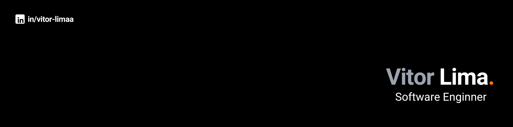

# Olá, me chamo Vitor! 👋

Atuo como engenheiro de software. Minha experiência inclui desde a construção de interfaces responsivas até a integração com APIs e lógica de negócios. Trabalho principalmente com JavaScript e TypeScript, utilizando frameworks e bibliotecas como React, Vue.js, Angular, React Native, Next.js e Node. Tenho forte interesse por arquitetura de software, boas práticas de desenvolvimento e desempenho de aplicações.

 

 

### Tecnologias que utilizo atualmente:

  

  

 

   

<!-- 

